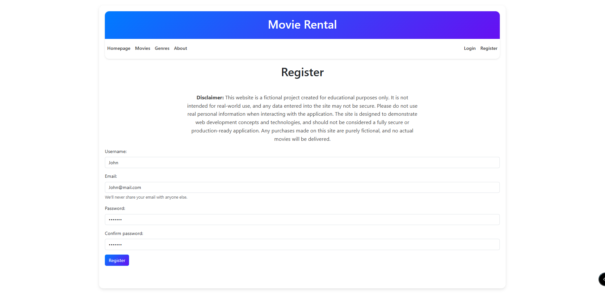
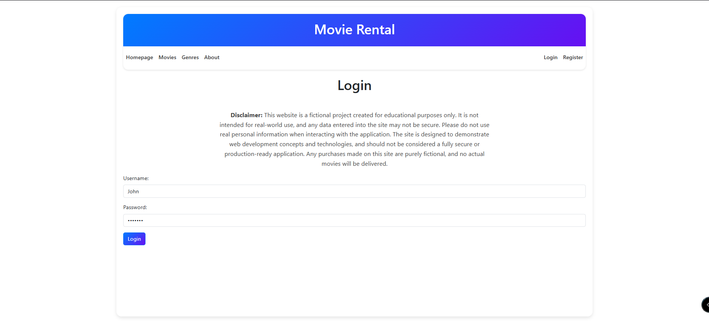
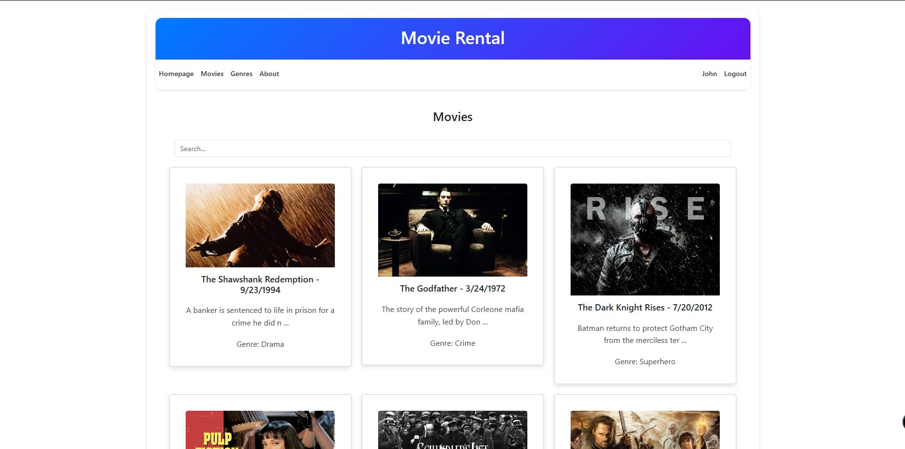
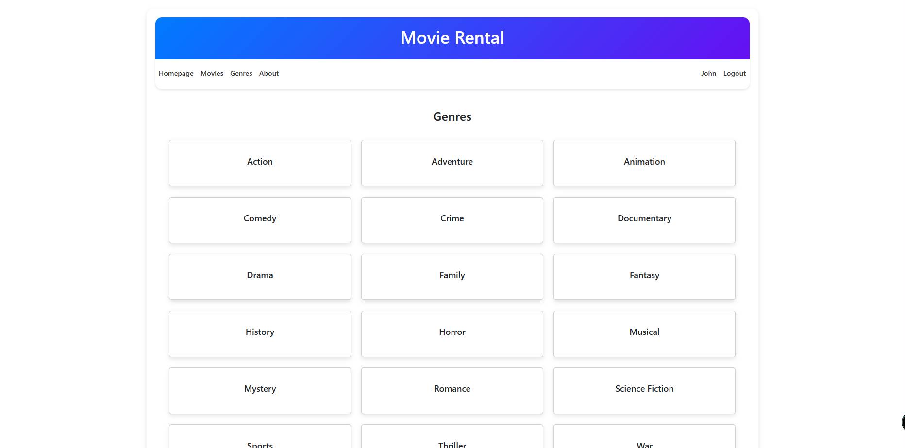
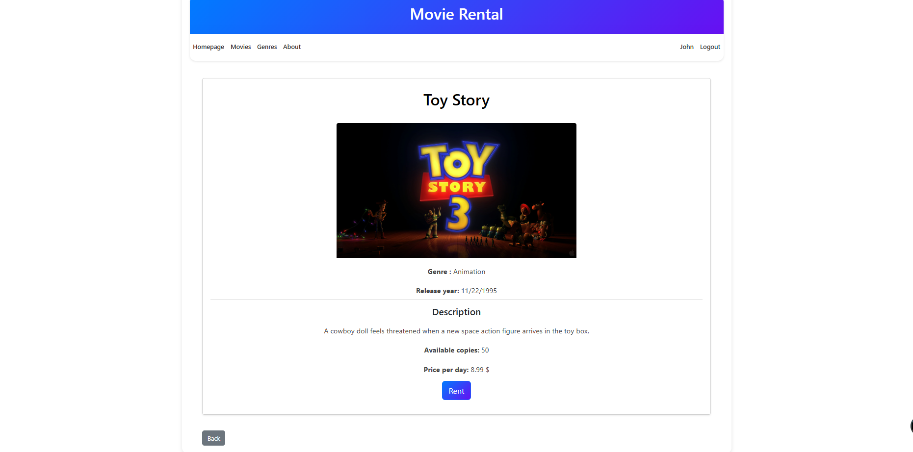
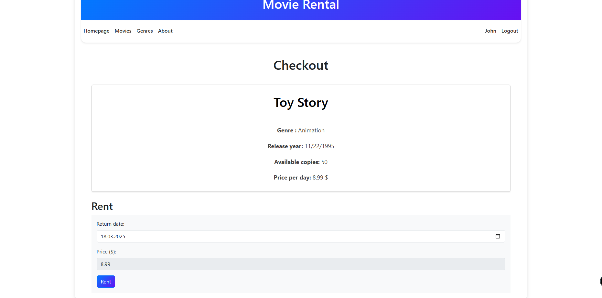
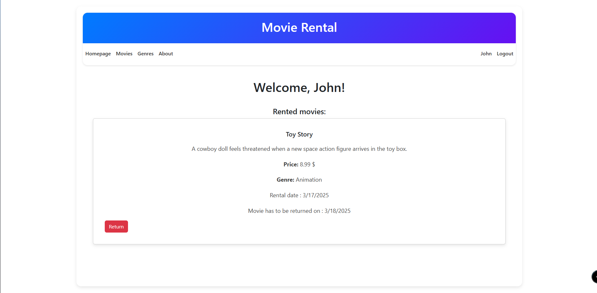

# Movie-Rental-Web

## Description

**Movie-Rental-Web** is a comprehensive web application that enables users to browse, rent, and manage movies. It features a robust backend API and an intuitive frontend user interface, designed to provide a seamless movie rental experience.

**Disclaimer:** This website is a fictional project created for educational purposes only. It is not intended for real-world use, and any data entered into the site may not be secure. Please do not use real personal information when interacting with the application. The site is designed to demonstrate web development concepts and technologies, and should not be considered a fully secure or production-ready application. Any purchases made on this site are purely fictional, and no actual movies will be delivered.

---

## Features

- **User Authentication:** Registration and login functionality.
- **Movie Management:**
  - View a list of available movies.
  - Search for movies by title.
  - Rent and manage movie rentals.
- **Admin Panel:**
  - Add, edit, and delete movies and genres.
- **Authentication & Authorization:**
  - JWT-based authentication with refresh and access tokens.
- **Responsive Design:** Optimized for both mobile and desktop devices.

---

## Technologies Used

### Backend:
- **ASP.NET Core 9.0**: For building the API.
- **Entity Framework Core 9.0**: For database operations.
- **JWT Authentication**: Secure authentication using refresh and access tokens.

### Frontend:
- **Blazor**: For building the user interface.
- **Bootstrap 5.3**: Responsive design.

---

## Usage

### For Users:
- **Sign Up / Log In:** Create an account or log in.
- **Browse Movies:** Explore available movies and search by title.
- **Rent Movies:** Rent and monitor your current rentals.

---

## Screenshots

Here are some visuals of the application:

1. **Register Page:**
   

2. **Login Page:**
   

3. **Homepage:**
   

4. **Movies:**
   

5. **Genres:**
   

6. **Movie:**
   

7. **Checkout:**
   

8. **Rented Movies:**
   

---
