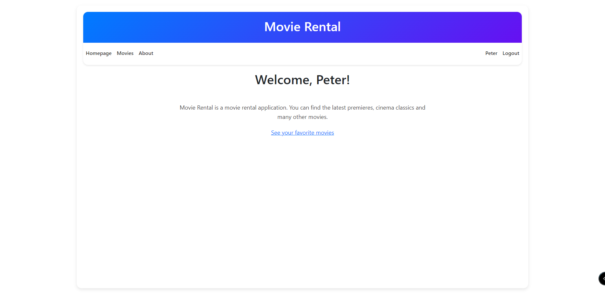
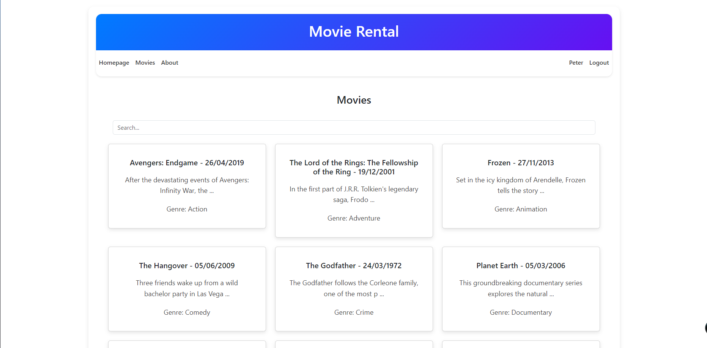
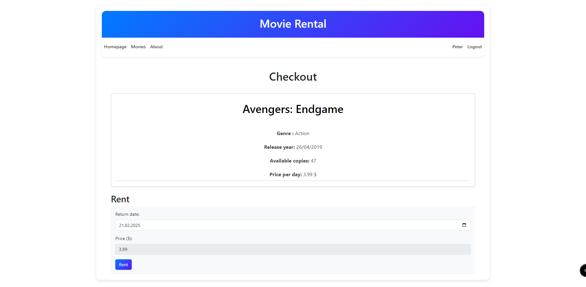
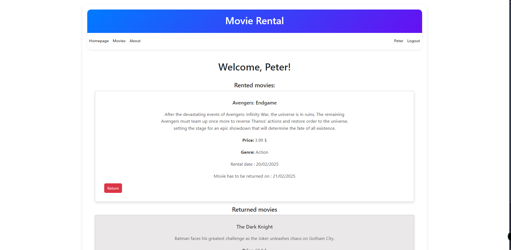

# Movie-Rental-Web

## Overview

Movie-Rental-Web is a web application that allows users to browse, rent, and manage movies. The application includes both a backend API and a frontend user interface.

## Features

- User registration and authentication
- Browse available movies
- Search for movies by title
- Rent movies and manage rentals
- Admin functionalities to add, update, and delete movies and genres
- JWT-based authentication and authorization with refresh token and access token
- Responsive design for mobile and desktop

## Technologies Used

- **Backend:**
  - ASP.NET Core 9.0
  - Entity Framework Core 9.0
  - SQLite
  - JWT Authentication with refresh token and access token
  - Swagger for API documentation

- **Frontend:**
  - Blazor
  - Bootstrap 5.3
  - Protected Browser Storage for authentication state

## Getting Started

### Prerequisites

- .NET 9.0 SDK
- Node.js (for frontend dependencies)

### Setup

1. Clone the repository:
   ```sh
   git clone https://github.com/1-xB/Movie-Rental-Web.git
   cd Movie-Rental-Web
   ```

2. Navigate to the backend project directory and restore dependencies:
   ```sh
   cd MovieRental
   dotnet restore
   ```

3. Apply database migrations:
   ```sh
   dotnet ef database update
   ```

4. Navigate to the frontend project directory and restore dependencies:
   ```sh
   cd ../MovieRental.Frontend
   npm install
   ```

5. Build and run the backend and frontend projects:
   ```sh
   dotnet run --project ../MovieRental
   dotnet run --project MovieRental.Frontend
   ```

6. Open your browser and navigate to:
   - Backend API: [https://localhost:7242](https://localhost:7242)
   - Frontend: [https://localhost:5001](https://localhost:7086)

---

## Usage

- **Users:**
  - Register a new account or log in to an existing one.
  - Browse and search for movies by title.
  - Rent available movies and manage your rentals.

- **Admin:**
  - Log in with an admin account.
  - Add, update, or delete movies and genres via the admin dashboard.

---

## API Documentation

The backend API is documented with Swagger.  
Once the application is running, navigate to [https://localhost:7242/swagger](https://localhost:7242/swagger) to explore the API endpoints.

---

## Screenshots

Below are some screenshots from the application:

1. **Homepage:**
   

2. **Movie List:**
   

3. **Movie Rental:**
   

4. **User Profile:**
   
